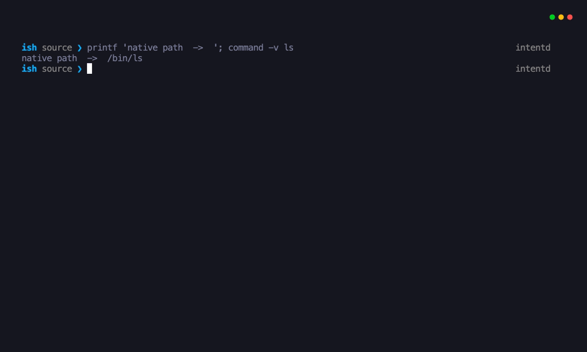

<h1 align="center">ish</h1>

<p align="center"><strong>The intent shell.</strong><br>Native when you know the command. Agentic when you state the intent.</p>

<p align="center">
  
  
  
</p>



`ish` is a new shell for the agent era. It keeps zsh authoritative, so `ls`,
pipelines, functions, completion, job control, and scripts behave like the shell
you already trust. A deterministic local gateway sends only explicit or
high-confidence intent to Pi. The internal `intentd` service keeps jobs,
context, and live shell capsules available across terminals.

```text
ls -la                         # native zsh; no model call
? compare these two services  # Pi, without rewriting the visible command
/capsules                     # one system view across live ish sessions
```

## Why ish

- **No latency tax on known commands.** Native syntax stays on an LLM-free zsh
  fast path.
- **The agent lives inside the shell.** The shell owns editing, history,
  sessions, process state, and execution; Pi supplies intelligence when asked.
- **One system context.** `intentd` persists work and topology-scoped context
  across terminals instead of creating a disposable shell inside each chat.
- **Effects remain inspectable.** Pi starts with read-only tools. Recognized
  destructive commands show an in-editor, one-shot approval bound to the exact
  displayed command.
- **Cross-shell actions fail explicitly.** Versioned shell capsules validate
  identity, generation, cwd, expiry, typed input, and operation ID before work
  runs inside a target zsh.

## Install

The evaluated target is a single-user Linux server with Node.js 22.19+, zsh
5.8+, and a systemd user manager. tmux 3.2+ enables topology selectors and the
multi-shell demo.

```bash
./scripts/install.sh
ish doctor
ish
```

The installer uses the locked npm graph, installs under `~/.local` by default,
and enables `ish-intentd.service` when a systemd user manager is available. Use
`ISH_PREFIX=/another/prefix` to select another prefix or `--no-service` to skip
service setup. It does not edit `.zshrc`, `/etc/shells`, or the login shell.

Run the installer again to upgrade atomically. Uninstall with:

```bash
./scripts/uninstall.sh
```

Configuration and state are preserved on uninstall so a reinstall can recover
them. The uninstaller prints the two directories to remove for an explicit
purge.

## Configure Pi

Provider and model identifiers are safe to persist:

```bash
ish config set provider deepseek
ish config set model deepseek-v4-flash
ish config show
```

Credentials are deliberately not accepted by `ish config`. Inject them into
the shell process without putting the value in history or a project file:

```zsh
read -rs 'API key: ' ISH_SECRET; print
export DEEPSEEK_API_KEY="$ISH_SECRET"
unset ISH_SECRET
ish doctor
```

Direct `?` requests inherit the current shell environment. Durable Pi jobs
inherit the environment of `intentd`; for a temporary systemd-manager
environment, use `systemctl --user import-environment` deliberately and remove
it when finished. Never place credentials in the unit file.

## Use

### Native and agent input

Known shell syntax executes exactly where it was typed:

```text
git status
for log in *.log; do wc -l "$log"; done
```

Prefix an intent with `?` or `/ask`. ish preserves that original line in zsh
history and invokes Pi behind the editor; it never exposes an expanded
`ishctl ask` command.

```text
? explain why nginx is restarting and cite the evidence
```

Pi receives an identity contract that describes the environment as **ish
(intent shell)**, a new system-level shell built on zsh and Pi. Its default
tools are read-only: `read`, `grep`, `find`, `ls`, and ish's bounded
`system_inspect` extension. The extension measures exact file sizes and metadata
without accepting command strings or following symlinked directories.

```text
? summarize the five largest files in this directory
```

Direct-directory inspection is the default. Pi can request a recursive scan,
but traversal is capped by depth, entry count, and time; a capped or
error-affected result is explicitly marked incomplete.

### Approval

Commands matching the deterministic risk policy pause inside ZLE:

```text
! ish approval required [danger/recursive-delete] | rm -rf ./cache | ...
y=run once e=edit n=cancel
```

`y` runs only the displayed buffer. `e` returns it to the editor, where any
change is classified again. `n`, Enter, and unknown keys cancel without an
effect. The classifier is defense in depth, not a sandbox; read `SECURITY.md`
before granting Pi additional tools through `ISH_PI_TOOLS`. The interaction
ordering is informed by openEuler
[Witty](https://mp.weixin.qq.com/s/lnRTcCLZeXadeYawfh_W6Q): read-only first,
then explicit approval, then operation.

### Sessions and durable work

```bash
ishctl capsules
ishctl context show
ishctl submit inspect the failed deployment
ishctl list
ishctl logs in_EXAMPLE
ishctl cancel in_EXAMPLE
```

Preview a read-only action against a topology selector, then dispatch its stable
operation ID:

```bash
ishctl action session:prod --class observation -- uptime
ishctl action-dispatch op_EXAMPLE
```

Mixed target results remain `partial`; restart ambiguity remains `uncertain`;
neither is collapsed into success or retried automatically.

## Manage the service

```bash
ish service status
ish service restart
ish service logs
ish service stop
ish service start
```

The unit is user-scoped, starts with the login session, restarts on failure, and
contains no provider credential. Native commands and direct agent requests keep
working when `intentd` is stopped; durable jobs, context, and capsules do not.

## Make ish the login shell

Try `ish` interactively first, then print the exact host-specific procedure:

```bash
ish doctor
ish default-shell
```

The procedure asks an administrator to add the resolved `ish` path to
`/etc/shells`, then uses `chsh -s`. It also prints the zsh rollback command.
ish never performs either privileged or account-changing step automatically.

## Architecture

| Component | Responsibility |
| --- | --- |
| zsh + `shell/ish.zsh` | Authoritative editor, history, native execution, prompt, approvals, and shell-resident admission |
| Pi | Agent loop, provider integration, and read-only reasoning tools |
| `intentd` | User daemon for durable jobs, scoped context, capsules, action state, and restart reconciliation |
| `ishctl` | Inspectable local control and data plane |

The research action path does not use `tmux send-keys`. A private FIFO wakes a
ZLE widget in each target shell; that widget validates the versioned action and
executes admitted work inside its own zsh. Raw tmux text injection remains only
as an explicitly unsafe comparison baseline.

## Develop

```bash
npm ci --no-audit
npm audit
npm test
npm run demo
```

The suite covers deterministic routing, terminal formatting, real zsh ZLE,
approval cancellation/execution, capsule races, restart recovery, context,
durable jobs, real isolated tmux panes, configuration, launcher compatibility,
systemd unit lifecycle, and disposable-prefix install/upgrade/uninstall.
The post-install step also verifies and applies the temporary Pi dependency
hardening documented in `SECURITY.md`.

The terminal GIF is reproducible with
[VHS](https://github.com/charmbracelet/vhs):

```bash
vhs demo/ish.tape
```

The tape runs the real shell, daemon, routing, capsule, and approval paths. Its
model response uses `demo/pi-fixture.mjs` so recording is deterministic and
never needs a credential.

## Current scope

ish currently targets one trusted user on one Linux host. The risk classifier
is not complete effect inference, external effects are not transactional,
uncertain operations are not automatically retried, and multi-user or fleet
authorization is not implemented. Engineering readiness does not establish
product demand or research novelty.

## Acknowledgments

ish stands on two exceptional projects: [zsh](https://www.zsh.org/) provides
the authoritative shell semantics, editor, history, and job control;
[Pi](https://github.com/earendil-works/pi) provides the agent runtime, provider
integration, and terminal intelligence. ish is a new shell built from their
strengths, and both projects are explicitly credited rather than hidden behind
the integration.
